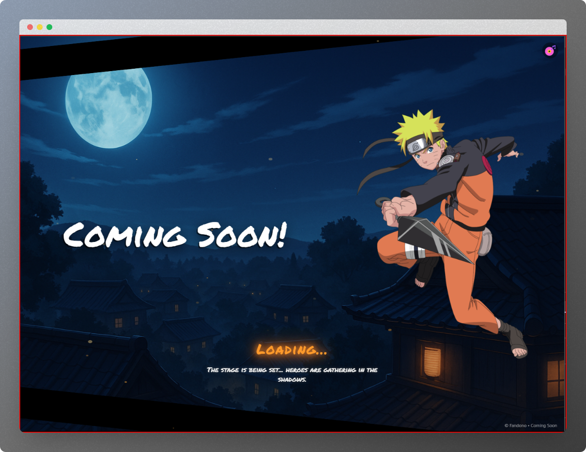

---

```markdown
# 🌸 Fandono — Coming Soon Page

> **A live "Coming Soon" page for Fandono**, a sub-brand anime niche website under **Myprus**, created as part of their main brand development process.  
> This page was deployed as a teaser while the full **Fandono** site was under construction, delivering an immersive anime-inspired experience for early visitors.

---

## 📖 Project Overview

**Fandono** is an anime-themed subbrand of **Myprus**, tailored for fans of Japanese animation culture.  
While working on the main Fandono platform, we developed this **"Coming Soon"** page to:

- Create excitement & anticipation.
- Keep the brand active in the public eye.
- Showcase Fandono's unique style & vibe.

The design is **heavily anime-inspired**, with a mix of modern UI techniques and playful storytelling, hinting at "heroes gathering in the shadows."

---

## ✨ Features

- **Full-Screen Immersive Layout** — No scroll, responsive, safe-area friendly.
- **Dynamic Background Animation** — Smooth zoom-in/zoom-out effect.
- **Custom Anime Character Illustration** — Ninja character breathing animation.
- **Particle Effects** — Canvas-based animated firefly-like particles.
- **Interactive Music Player** — Play/pause Naruto-inspired background music.
- **Mobile-Friendly** — Optimized layout & safe-area insets for devices with notches.
- **Thematic Loading Text** — Glowing, bouncing "Loading..." with subtle lore.
- **Skewed Decorative Panels** — Stylish slanted black panels at top and bottom.
- **Zero Dependencies** — Built with HTML, CSS (Tailwind + custom), and vanilla JavaScript.

---

## 🛠️ Tech Stack

| Layer      | Details |
|------------|---------|
| **HTML5**  | Semantic structure, responsive meta tags |
| **CSS3**   | TailwindCSS CDN + custom styles, animations, safe-area handling |
| **JavaScript** | Vanilla JS for animations, particle system, and audio controls |
| **Media Assets** | Custom ninja illustration, background image, background music (`naruto_theme.mp3`) |

---

## 📂 File Structure

```

Fandono-Coming-Soon/
│
├── index.html          # Main HTML file
├── assests/            # Media assets folder
│   ├── bg.jpg          # Background image
│   ├── ninja1.png      # Ninja illustration
│   ├── romantic-music\_9070197.png # Music toggle icon
│   └── naruto\_theme.mp3 # Background audio
└── README.md           # Project documentation

````

## 🚀 Deployment

1. **Clone or Download**
   ```bash
   git clone https://github.com/yourusername/fandono-coming-soon.git
````

2. **Host on Any Static Server**

   * You can use GitHub Pages, Netlify, or Vercel.
   * Or simply open `index.html` in your browser for local preview.

3. **Ensure Assets are in the Correct Path**

   * Keep `assests/` folder in the same directory as `index.html`.

---

## 🎯 Usage Notes

* **Music Autoplay**:
  Some browsers block autoplay. The script auto-plays when possible; otherwise, the user must interact once to start music.
* **Performance**:
  The particle system is lightweight, but background animations can be GPU-intensive on very low-end devices.

---

## 📸 Preview



---

## 📜 License

This project was developed as part of a **live commercial project** for Myprus / Fandono.
Rights are owned by **Myprus**. Public reproduction, resale, or redistribution without permission is prohibited.

---

**© Fandono • A Myprus Subbrand**
s